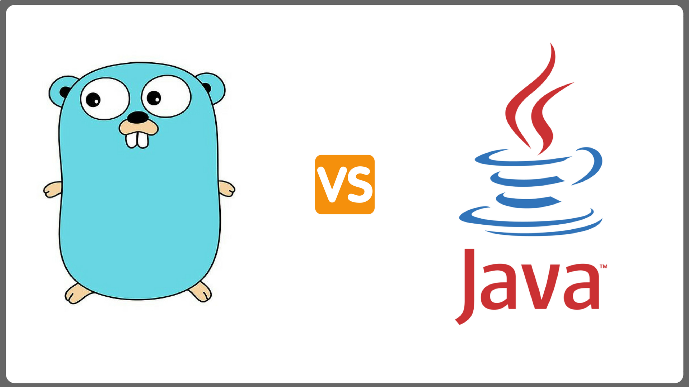

转载请注明出处：[https://www.cnblogs.com/funnyzpc/p/10801474.html](https://www.cnblogs.com/funnyzpc/p/10801474.html)


#### 第二节内容概览

+ 循环(for、switch)
+ 多值返回
+ defer & finally
+ init(go) 与默认构造函数(java)
+ 常量、静态变量(const 与 static final)
+ 参数或方法访问属性


##### 循环
+ go
  go提供了range关键字可以循环各种切片和数组，同时也提供了多参，这点相比较java会灵活不少，
  另外switch循环也不同与java，默认仅进入匹配的case内不会往下循环，若需要往下循环需要用到
  fallthrough关键字，这个也确实有利于开发，不用像java一样写return结束。
  ```
    func main() {
        arr := []string{"a", "b", "c"}

        for val := range arr {
            fmt.Println(arr[val])
        }

        for i := 0; i < 10; i++ {
            fmt.Println(i)
        }

        caseVal := "C"
        switch caseVal {
        case "A":
            fmt.Println("This is A")
        case "B":
            fmt.Println("This is B")
        case "C":
            fmt.Println("This is C")
        default:
            fmt.Println("This is other word!")
        }

    }
  ```

+ java
  java 提供了多种循环，分别是for、foreach、Stream foreach(java8提供)，while、do while
  switch ，我就直接展示代码吧。
  ```
    @Test
    public void forTest(){
        String[] arr = new String[]{"A","B","C"};
        for (String item:arr) {
            LOG.info(item);
        }

        for(int i=0;i<arr.length;i++){
            LOG.info(arr[i]);
        }

        String word = "B";

        switch (word){
            case "A":
                LOG.info("This is A");
                break;
            case "B":
                LOG.info("This is B");
                break;
            case "C":
                LOG.info("This is C");
                break;
            default:
                LOG.info("This is Other word!");
        }
    }
  ```

###### 多值返回
+ go
  go提供了多参返回，当参数较少当时候可以一次性返回，不用构造结构体返回
  ```
    func main() {
    	a, b, c, err := process(11, "A", true)
    	fmt.Println(a, b, c, err)
    }

    func process(aa int32, bb string, cc bool) (int32, string, bool, error) {
    	var ccReturn bool
    	if true == cc {
    		ccReturn = false
    	} else {
    		ccReturn = true
    	}
    	return aa + 1, bb + "_return", ccReturn, nil
    }

  ```

+ java
  java并没有提供多参返回，若要实现多参返回，一般将返回参数封装入Map、List 这类集合类型中，
  或者构造一个新对象放入返回值后返回。
  ```
        @Test
        public void returnObjec(){
            Map<String,Object> result = this.processObj();
            LOG.info(new JSONObject(result).toString());
        }

        public Map<String,Object> processObj(){
            return new HashMap<String,Object>(){{
                put("val1",true);
                put("val2","str");
                put("val3",999777L);
            }};
        }
  ```

##### defer & finally
+ go
  首先 defer 和 finally 大多用于资源关闭或异常处理
  go中的defer 与 java的finally个人感觉是相似的，但是如果将defer放入到循环内的话可就像
  一个反向队列了，若一个处理逻辑内有多个defer的时候 先defer的晚于后defer,很有意思，大家可以试试哈～
  ```
    func main() {
        doSomething()
    }

    func doSomething() {
        fmt.Println("something start")
        defer fmt.Println("something defer")
        fmt.Println("something end")

        arr := []string{"a", "b", "c"}
        for val := range arr {
            defer fmt.Println(val)
        }
    }

  ```

+ java
  java 的finally 大多用于异常处理，尤其是文件流异常处理，同时也不存在类似于defer的倒序处理，
  这里就给个简单的例子～
  ```
    @Test
    public void processFinal(){
        String[] arr = new String[]{"A","B"};

        try{
            LOG.info(arr[2]);
        }catch (Exception e){
            LOG.info("异常了：{}",e);
        }finally {
            LOG.info("最后进入～");
        }
    }
  ```

##### init 与默认构造函数
+ go
  go不存在默认构造函数，但是提供了init函数；我一开始也想不起来go的init函数如何与java的初始化
  对比，灵机一动就有了无参的构造函数，虽然这样对比其实并不恰当，但是功能上是有相似的地方。另外需要
  说明的是go的init的函数是在包被引入的时候调用的 若与main函数存在同一代码块 也是init先被调用，
  而java的默认构造函数仅在对象被new的时候调用的。
  ```
    func main() {
    	fmt.Println("func main()")
    }

    func init() {
    	fmt.Println("func init()")
    }

  ```

+ java
  java的默认构造方法其实并不常用，但是在每启一个类的时候都有默认的构造方法，若是定义了就会走默认的构造
  方法，若无则在编译为class文件的时候自动为所在类加入一个。
  ```
    public class ConstructTest {
        private static final Logger LOG = LoggerFactory.getLogger(ConstructTest.class);
        @Test
        public void processConst(){
            LOG.info(">>> start");
            Person person = new Person();
            LOG.info(">>> end");
        }
    }

    class Person{
        private static final Logger logger = LoggerFactory.getLogger(Person.class);
        private String name;
        private Integer age;

        public Person() {
            logger.info("default Constructor");
        }

        public String getName() {
            return name;
        }

        public void setName(String name) {
            this.name = name;
        }

        public Integer getAge() {
            return age;
        }

        public void setAge(Integer age) {
            this.age = age;
        }
    }
  ```

###### const 与 static final
+ go
  go的静态(也可叫静态常量，主要用于基本数据类型)，使用关键字const指定。
  使用const定义的静态变量是不可用修改或赋值的。
  ```
    const name int = 11

    const (
        a = "hello"
        b = true
        c = 99
    )

    func main() {
        fmt.Println(name)
        fmt.Println(a)
        fmt.Println(b)
        fmt.Println(c)
    }

  ```
+ java
  java的常量需要用两个关键字修饰 `static` 和 `final` ,前者表示静态的意思，但这个静态是可以被修改的，
  修改的前提是类型不变，而第二个关键字表示最终的意思，一旦变量被这个关键字修饰则不可重新修改变量。
  但是对于复合对象，比如List、Map、自定义对象等，又是可以被修改的,对于这点个人觉得 java 的常量的定义
  并不够严谨。
  ```
  public class staticFinalTest {
      private static final Logger LOG = LoggerFactory.getLogger(staticFinalTest.class);
      private static final String name = "Tom";

      private static String item = "first item";

      private static final List<String> initArr = new ArrayList<String>(){{
          add("A");
          add("B");
          add("C");
      }};

      @Test
      public void process(){
          LOG.info(name);

          item = "youth!";

          LOG.info(item);

          initArr.add("hello");

          LOG.info(initArr.toString());
      }
  }

  ```

##### 参数或方法访问属性
+ go
  go 的方法或参数需要被外部访问，需要使用大写开头参数名或函数名(go文件大小写是与与否与是否私有无关)
  ```
    // 可被文件外函数访问
    var Name string = "John"

    func main() {
        fmt.Println(Name)
        Process()
    }

    // 可被文件外函数调用
    func Process() {
        fmt.Println("Process()")
    }

  ```

+ java
  java的参数或方法属性不同于go，大致分为三类：

  - private 仅当前类内访问
  - public  可公共访问
  - protect 仅可同包内访问

  ```
    public class ObjectTypeTest {
        private static final Logger LOG = LoggerFactory.getLogger(ObjectTypeTest.class);

        //私有访问（仅可同一类中）
        private String name1 = "name01";
        // 保护访问（仅可同一包内）
        protected String name2 = "name01";
        // 公共访问 (任何类均可访问)
        public String name3 = "name01";

        @Test
        public void process(){
            LOG.info(this.doSomeThing());
            LOG.info(name1);
            LOG.info(name2);
            LOG.info(name3);

        }

        public String doSomeThing(){
            return "hello";
        }

    }

  ```


