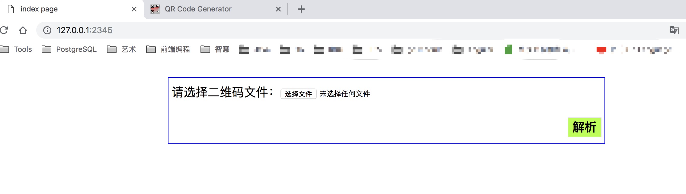
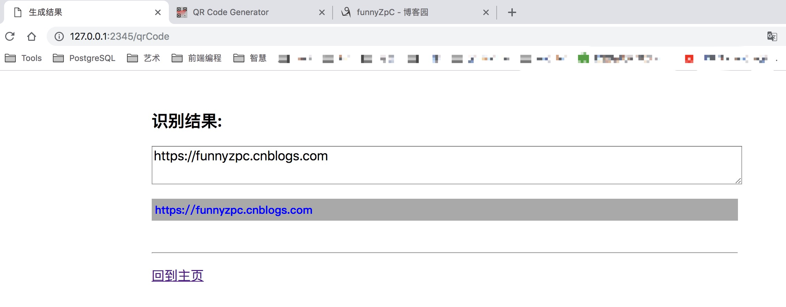

### GO语言简单web应用 & 二维码生成及解码 & 打包部署

#### 前言(闲扯)
```
(20190503)我知道今天会有其他活动，因此我提前买了杯咖啡，
(20190504)我知道深夜会完不成博客, 因此我加班到了这个点。
首先需要做的事情，Demo 准备并调试
还需要做的事情，构建github项目
以及要做的事情，README文档编写
最后要做的事情，生成一篇博客
```

#### 简单WEB应用
  话说一个简单的WEB应用需要多少行依赖，多少行代码，运行需要多大的package,需要多大的运行环境？

+ 对于java：
    - 我需要构建下面这些包(5MB+)
    ```
          01） aopalliance-1.0.jar                aop的工具包                 `
          02） commons-logging-1.1.3.jar          commons的日志管理
          03） spring-aop-3.2.8.RELEASE.jar       Spring的切面编程
          04） spring-beans-3.2.8.RELEASE.jar     SpringIoC(依赖注入)的基础实现
          05） spring-context-3.2.8.RELEASE.jar   Spring提供在基础IoC功能上的扩展服务
          06） spring-core-3.2.8.RELEASE.jar      Spring的核心包
          07） spring-expression-3.2.8.RELEASE.jar  Spring表达式语言
          08） spring-web-3.2.8.RELEASE.jar         SpringWeb下的工具包
          09） spring-webmvc-3.2.8.RELEASE.jar      SpringMVC工具包
          10） jstl-1.1.2.jar                       JSP标准标签库
    ```
    - 需要编写以下代码(14行+)
    ```
          package com.test.controller;
          import org.springframework.stereotype.Controller;
          import org.springframework.ui.Model;
          import org.springframework.web.bind.annotation.RequestMapping;
          import org.springframework.web.bind.annotation.RequestMethod;

          @Controller
          @RequestMapping(value="/hello")
          public class HelloController {
              @RequestMapping(value="/world",method=RequestMethod.GET)
              public String hello(Model model){
                  model.addAttribute("msg", "你好spring mvc");
                  return "index";
              }
          }
    ```
    - 打包(jar or war 5MB+)
    - 部署和环境(jdk 100MB+ , tomcat 5MB+ total：105MB+)
+ 对于Go
    - 需要代码(15行+)
    ```
    package main

    import (
    	"fmt"
    	"log"
    	"net/http"
    )

    func main() {
    	http.HandleFunc("/", index)
    	log.Println("请访问:", "http://127.0.0.1:2222")
    	http.ListenAndServe(":2222", nil)
    }

    func index(w http.ResponseWriter, r *http.Request) {
    	fmt.Printf("[%s|%s] -> http://%s%s \n", r.Method, r.Proto, r.Host, r.RequestURI)
    	dateTime := time.Now().Format("2006-01-02 15:04:05")
    }
    ```
    - 打包(<6MB,upx加壳<2MB)
    - 部署和环境(<6MB or <2MB)

结论：一个java web应用部署不小于100MB，而一个go web应用最少只需要2MB，你真的没听错他真的很小而且迅速，唯一不能比的是
java的生态 太庞大了，这是java之所以存在的优势，不过这终将成为历史。

(以上 go 代码在这里：[simpleServer.go](https://github.com/funnyzpc/go-project-example/blob/master/src/qrCodes/simpleServer.go))

#### 二维码生成及解码

 二维码简称(QR CODE),中文全名叫快速响应码，他的基础基础包含：向量运算、字符编码、图形识别等，需要具体了解的可涉猎此
 [二维码原理](https://www.cnblogs.com/alantu2018/p/8504373.html)，这里不再从算法底层开始写起(毕竟大多数人都不会哈)，
 主要用到了开源都两个依赖(编码和解码)

+ 二维码生成

  这里用到了[go-qrcode](https://github.com/skip2/go-qrcode)

 - Demo主要逻辑(已调试通过)
 ```
    // 写二维码
    func writeQrCode() {
    	// 写二维码
    	err := qrcode.WriteFile("https://funnyzpc.cnblogs.com", qrcode.Medium, 256, "D:/tmp/cnblogs.png")
    	if err != nil {
    		fmt.Println(err)
    	}
    }
 ```

+ 二维码解码

  这里用到了[qrcode](https://github.com/tuotoo/qrcode)

    - Demo主要逻辑
    ```
    func ReadQrCode(){
        //获取上传的第一个文件
        file, _, _ := os.Open("本地文件路径")
        // 读取文件
        qrmatrix, err := rQrCode.Decode(file)
        defer file.Close()
        if err != nil {
            fmt.Println(err.Error())
            return
        }
        log.Println("获取到二维码内容：", qrmatrix.Content)
    }
    ```

#### 二维码解析+WEB服务

  一个产品的终态必将是一些列技术的组合，比如搭建一个在线的二维码解析应用。

+ 参考代码
  ```
    func main() {
        http.HandleFunc("/", IndexAction)
        http.HandleFunc("/qrCode", ReadQrCode)
        log.Println("请打开页面: http://127.0.0.1:2345")
        http.ListenAndServe(":2345", nil)
    }

    // 主页
    func IndexAction(writer http.ResponseWriter, request *http.Request) {
        t, err := template.ParseFiles("template/page/index.html")
        if err != nil {
            log.Println(err)
        }
        t.Execute(writer, nil)
    }

    type QrCode struct {
        QrContent string
    }

    // 读取二维码
    func ReadQrCode(writer http.ResponseWriter, request *http.Request) {
        //判断请求方式
        if request.Method == "POST" {
            //设置内存大小
            request.ParseMultipartForm(64 << 20)
            //获取上传的第一个文件
            file, _, _ := request.FormFile("qrFile")
            // 读取文件
            qrmatrix, err := rQrCode.Decode(file)
            defer file.Close()
            if err != nil {
                fmt.Println(err.Error())
                return
            }
            log.Println("获取到二维码内容：", qrmatrix.Content)

            t, err := template.ParseFiles("template/page/qrCode.html")
            if err != nil {
                log.Println(err)
            }
            t.Execute(writer, QrCode{QrContent: qrmatrix.Content})
        } else {
            //解析模板文件
            t, _ := template.ParseFiles("template/page/qrCode.html")
            //输出文件数据
            t.Execute(writer, nil)
        }
    }


    // 读二维码
    func readQrCode() {
        file, error := os.Open("D:/tmp/cnblogs.png")
        if error != nil {
            fmt.Println(error.Error())
            return
        }
        defer file.Close()
        qrmatrix, err := rQrCode.Decode(file)
        if err != nil {
            fmt.Println(err.Error())
            return
        }
        fmt.Println(qrmatrix.Content)
    }
  ```

+ 最终效果图

    - 主页
    

    - 结果
    

#### 打包部署

 对于部署，在前面java和go的对比中已经提到过，go 应用不存在虚拟机，他的代码是直接从文本编译成二进制包(包含运行环境) 最终也必然是轻巧无依赖的，
 另外，需要说的是go 的 打包本身是不加壳的，源包会比较大，一般部署时会做两个处理。

+ 使用 `-ldflags` 去掉符号 去掉调试 压缩体积

+ 同时使用upx加壳 `upx --backup --brute [PACKAGE_FILE_NAME]` 以进一步压缩体积(压缩至1/3),加密软件包，这样利于传输发布同时还能保持原生包的功效哦～

这里我简要给出一般的打包命令：
```
linux `GOOS=linux GOARCH=amd64 go build -ldflags "-w -s" ./main.go`
window `GOOS=windows GOARCH=amd64 go build -ldflags "-w -s" ./main.go`
mac `GOOS=darwin GOARCH=amd64 go build -ldflags "-w -s" ./main.go`
```

引用加壳命令：
```
upx --backup --brute [main.exe(windows) or main(linux、mac)]

```

最后上线部署：
```
    linux: ./[PACKAGE_FILE] &
    mac: ./[PACKAGE_FILE] &
    windows: 双击[PACKAGE_FILE.exe],或将[PACKAGE_FILE.exe]配置为服务
```

#### 最后

 以上所有代码均在我的github项目中，若所言有误恳请指正～

 项目地址：[qrCodes](https://github.com/funnyzpc/go-project-example/tree/master/src/qrCodes)