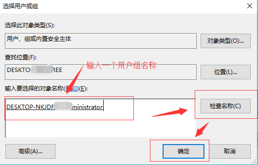

### window下设置定时任务及基本配置

```
    由于网络上大部分定时任务配置都不够清晰，甚至是错误的，基于此类原因，本人决定亲自出一版定时任务配置教程。
    本章主要介绍在windows下如何新建一个定时任务及中间可能出现的坑...
```

#### 首先妳得有一个执行脚本或应用
    `这个脚本可以是.bat、.cmd、.exe的文件`

+ 


#### 当脚本文件准备就绪，现在开始使用window 10系统配置定时任务

+ 1. 在菜单中找到任务计划程序，建议使用Cortana 或 任务栏搜索框搜索
    - 
+ 2. 打开任务计划程序后需要新建一个任务文件夹，像这样(名字可自定义)
    - 

+ 3. 任务文件夹创建完毕后 右键任务文件夹 选择"创建基本任务"
    - 

+ 4. 第一步：设置任务名称
    - 

+ 5. 第二步：设置触发器
    - 

+ 6. 第三步：设置任务执行时间
    - 

+ 7. 第四步：设置任务操作,这里为启动程序
    - 

+ 8. 第五步：设置启动程序或脚本(建议配置起始目录)
    - 

+ 9. 第六步：定义任务名称
    - 

+ 10. 到这一步，任务貌似已经配置完成,不过我还是建议您扫一眼以下内容


#### 当一切都看似完美无缺的时候，忽然发现你的脚本无法正常执行，当然这时候原因无非有三
+ 定时任务未配置在一个有效的组内(未按以上步骤配置)


+ 定时任务所在用户组用户无效或无权限,这里给出具体操作步骤
    - 
    - 

+ 未配置批处理用户组用户或批处理用户组用户未包含定时任务组用户,这里到具体操作步骤也一并给出

    1. 打开组策略配置窗口`GPEDIT.MSC`
        - 

    2. 配置组策略
        - 
        - 

    3. 配置批处理用户组(很重要)
        - 
        - 

> 到这里，配置完毕，各位晚安～

