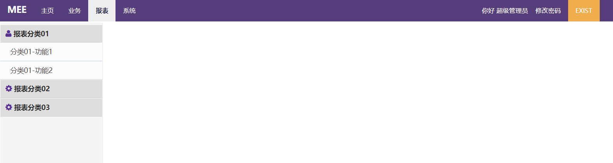

### **mee-admin**开源后台系统

#### Preface

```
  这是一个开放的时代，我们不能总是把东西揣在口袋里面自己乐呵。正如名言所说的“如果你有两块面包，你当用其中一块去换一朵水仙花”
  所以，继上一次把我的两个个人项目开源之后今天我再一次把自有的后台页面也开源出来，以回馈整个开源世界。
```

#### 项目结构概述

  mee-admin是由我的个人`mee`项目开源而来,`mee-admin`项目是一个前后端一体化的项目,不过在代码上实现了页面与数据分离，是一个非常好的
  轻量级后端工程，所以在正式使用时您会发现主体业务部门均是采用json交互，前端页面使用模板工具实现数据展现及编辑
  与`jeesite`不一样，我们不使用`jsp+sitmesh+ehcache`臃肿化项目
  与`Spring-Cloud-Platform` `xboot` 不一样,这里不使用`vue` `iview` 做前后端分离，也不使用`springclooud`做集群分布式
  所以我的项目更加轻量级，不需要装`node` 不需要`npm`打包 需不要安装`nginx` 同时也不需要编写无聊的mapper接口，不需要单独写增删改....
  所以对于企业内部需求开发更是无比的急速
  同时，`mee-admin`只需具有`java`后端以及一点点`javascript`开发能力，便可急速上手。

#### 项目技术相关

+ 使用`springboot 2.3.4.RELEASE`作为基础框架
+ 使用`mybatis`作为`dao`框架
+ 使用`postgreSQL` 作为框架DB(可支持`Mysql`及`Oracle`)
+ 使用`shiro`做权限管理
+ 使用`Freemarker`做页面模板
+ 使用`jquery` 插件作`javascript`基本扩展库使用
  - 目前只是一些组件依赖用,建议大多数情况下使用`ES5`或`ES6`规范的`javascript`扩展
+ 使用`handlebars`做表单及数据模板
+ 使用`seajs` 做基础模块管理
+ 封装了序列(`ID`)生成器(支持分布式)
    - `SeqGenServiceImpl` 序列生成器(支持分布式)
    - `SeqGenUtil` 普通序列生成器
+ 封装了`Jackson`的`json`库，完全可替代`fastjson`
+ 封装了物理分页`PhysicalPageInterceptor`及逻辑分页`LogicalPageIntercepter`(两个可任选其一)，完全替代`RowBounds`及一众分页依赖
+ 封装了`Excel`及`CSV`工具
  - `ExcelReadUtil` EXCEL读工具
  - `ExcelWriteUtil` EXCEL写工具
  - `CSVUtils` CSV读工具
+ 简单封装了java8日期工具类 `DateUtil`

#### 项目界面
+ **登录**
  
+ **主页**
  
+ **报表**
  
+ **基础配置**
  
+ **编辑及修改**
  
+ **系统配置**
  

#### 项目运行及打包
+ 本地项目运行 
  - Fork `mee-admin`
  - git clone `mee-admin` to local
  - init DB table []()
  - use Idea IDE open project 
  - auto build dependency
  - Idea start config
    - run `MeeApplication` and program arguments add `--spring.profiles.active=dev`
    - 注[dev、test、prod均为pom.xml下配置的环境参数](#)
  
+ 打包及Linux服务器构建脚本,见[???]()
    - 必须安装maven(方法请自行搜索引擎查找)
    
#### 项目访问
+ local: `http://127.0.0.1/mee/login`
+ server: `http://[Your DOMAIN or HOST+PORT]/mee/login`

#### Notice
 
 虽整个项目封装的较为完整, 但是对于一些自定义的展示还是需要有一定的前端技能
 作为补偿，这里大致写了功能开发流程[see:Function flow](#### Function flow),具体的还需要读者具体学习哈~

#### Function flow
+ 功能开发流程
    - 添加mybatis SQL xml文件及映射实体类entity
    - 编写控制器controller及业务service代码
    - 编写构建前端页面并添加菜单项
    - 添加依赖js[resources/public/module 下](#)
    - 后端添加权限标识[@RequiresPermissions("your_auth_code")](#)
    - 前端(菜单和业务页面)添加权限标识[<@shiro.hasPermission name="your_auth_code"></@shiro.hasPermission>](#)
    - 后台添加菜单项目
    - 后台角色权限分配

+ js添加对话框或按钮扩展功能([这是难点!](#))
``` 
       业务前端js采用模块化依赖并封装了表单著录以及增删改查相应功能，十分便捷，
    目前对于扩展功能(比如添加一个’重算‘) 需要自定义函数及相应逻辑，具体流程大致如下
```

  1. 在[search-form](#)内定义button控件(一定要有name属性)
  2. 在依赖的js文件内的init函数内定义扩展`toolbar:{ "控件属性名": 属性名对应函数 }`
  3. 编写相应函数逻辑
  
 
 #### end
   
   欢迎提交issue，如有好的建议及意也请留下脚印，这里先感谢哈😁
   同时, 如有困难可以咨询 `funnyzpc@gmail.com`