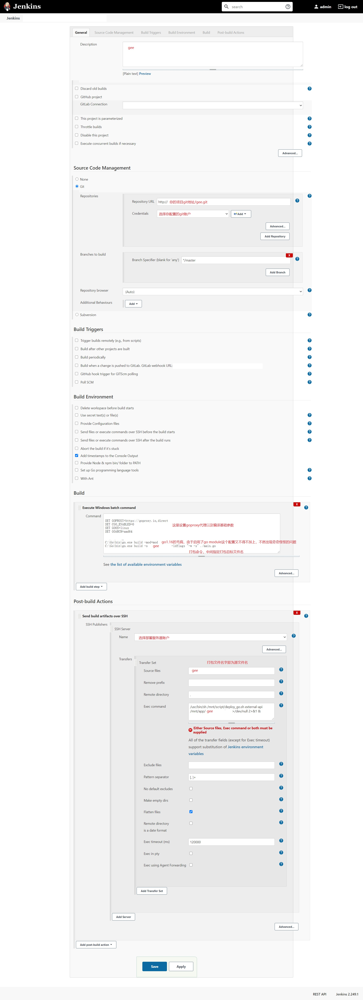

## jenkins构建go及java项目
>转载请注明出处[https://www.cnblogs.com/funnyzpc/p/14554017.html](https://www.cnblogs.com/funnyzpc/p/14554017.html)

### 写在前面

  jenkins作为java的好基友，经历过单体项目时代->集群项目时代->容器集群分布式时代，使用稳定可靠，cpu友好(就泪存有点儿难看),如果有问题就。。。
 

  (当然这种情况不多(_) ) , 至于后期又有了jenkins x(容器版)，对于非容器环境这里这里就不介绍啦

然后简略介绍我自己的项目情况吧，说说我的思路；首先我的项目有一个后台mee(java)、mee-api(多个,为Java项目)以及gee-api项目(多个,go项目),后台项目暂不集群分布(目前够用),
mee-api及gee-api项目只是个模子，主要做分布式或集群微服务，目前只有这三个微服务在跑，整个打包部署过程。。。纯手工（很麻烦），因为专注于开发目前ci/cd也不复杂，所以就借用了我
之前写的windows自动部署小工具,目测够用，但有一点儿较为麻烦，就是对于纯开发配置较为麻烦，每次运行还是需要配合服务端脚本，以及运行
命令也较为复制(偶尔也会有莫名其妙的问题)，所以这次特意研究了下jenkins（主要是近几个公司全用这个来构建）
因为我本人使用的win本，所以以下配置对于win的构建比较友好哈~

### 准备

首先，你得需要安装jenkins（自不必多说了。。。），以下为jenkins宿主机(windows)系统下需要~
+ jenkins
+ maven
+ jdk
+ go

### jenkins下安装插件(这里简要描述)

#### 安装
+ 路径： Manage Jenkins(jenkins管理)->Manage Plugins(插件管理)->搜索可用插件
+ 安装可用插件 ssh、git(或svn,视需求)、maven(或gradle，视需求)、
+ 配置权限模块(如果需要的话) Manage Jenkins(jenkins管理)->Global Security(全局安全)
+ 配置ssh账号(略)
+ 配置git或svn账号(略)

#### 基础配置
+ 路径： Manage Jenkins(jenkins管理)->Global Tool Configuration(全局工具配置)
+ 配置jdk
  -  
+ 配置git
  -  
+ 配置maven
  -  

### 添加视图标签
+ 添加视图标签`New View`(构建任务会放在指定标签下)
  -  

### 添加java构建
+ 选择(鼠标点击)新建的视图标签,然后选择左侧的`New Item`
  -  
+ 填写构建的基本信息
  -  
+ 构建配置详情
  -  

### 添加go构建

  首先说，默认按照插件的方式配置go的构建十分的麻烦(无法下载go sdk以及go项目依赖也无法拉取)，当然解决的方式也很简单；
  
  + go mod无法下载依赖::在window cmd命令中加入对go env的GOPROXY的设置(同理对于go打包的配置也是一致的)
  + 无法使用go的命令:: 在windows cmd命令行中使用绝对路径调用其命令
  
  以上问题的解决详见下图
  -  

### 相关脚本
+ jenkins 执行远程脚本命令

  - go应用执行脚本

   `/usr/bin/sh /mnt/sh/deploy_go.sh external-api /mnt/app/gee >/dev/null 2>&1 &`
  
  - java(springboot)应用执行脚本

    `/usr/bin/sh /mnt/sh/deploy_go.sh external-api /mnt/app/gee >/dev/null 2>&1 &`


+ java 部署脚本`deploy.sh`,记得部署的时候使用`chmod a+x deploy.sh`

```
#!/bin/sh
export BUILD_ID=dontKillMe
export JAVA_HOME=/usr/local/java/jdk1.8.0_222
export JRE_HOME=/usr/local/java/jdk1.8.0_222/jre

#项目名称 xxx.jar
project_name=$1
#部署路径
deploy_path=$2
#文件路径
upload_path=/mnt/pkg/$1

if [ -f "${upload_path}" ]; then
        # kill process
        ps -ef|grep ${project_name}|grep java|awk '{print $2}'|xargs kill -9
        # remove file
        rm -rf ${deploy_path}/${project_name}
        # backup file
        cp -r ${upload_path} ${deploy_path}/${project_name}_`date "+%Y%m%d%H%M%S"`
        # move file
        mv ${upload_path}  ${deploy_path}/${project_name}
        # exec deploy
        cd ${deploy_path} && nohup java -jar ${deploy_path}/${project_name} >/dev/null 2>&1 &
else
        exit 0
fi
  ```
 
+ go 部署脚本`deploy_go.sh`,创建脚本后同样需要`chmod a+x deploy_go.sh`

```
#!/bin/sh
export BUILD_ID=dontKillMe

#example gee
project_name=$1
#deploy path
deploy_path=$2
#file path
upload_path=/mnt/pkg/$1

if [ -f "${upload_path}" ]; then
        # kill process
        kill -9 `ps -C ${project_name} -o pid=`
        # remove file
        rm -rf ${deploy_path}/${project_name}
        # backup file
        cp -r ${upload_path} ${deploy_path}/${project_name}_`date "+%Y%m%d%H%M%S"`
        # move file
        mv ${upload_path}  ${deploy_path}/${project_name}
        # add exec auth
        chmod a+x ${deploy_path}/${project_name}
        # exec deploy
        cd ${deploy_path} && nohup ./${project_name} > ./${project_name}.log 2>&1 &
else
        exit 0
fi
```

  
